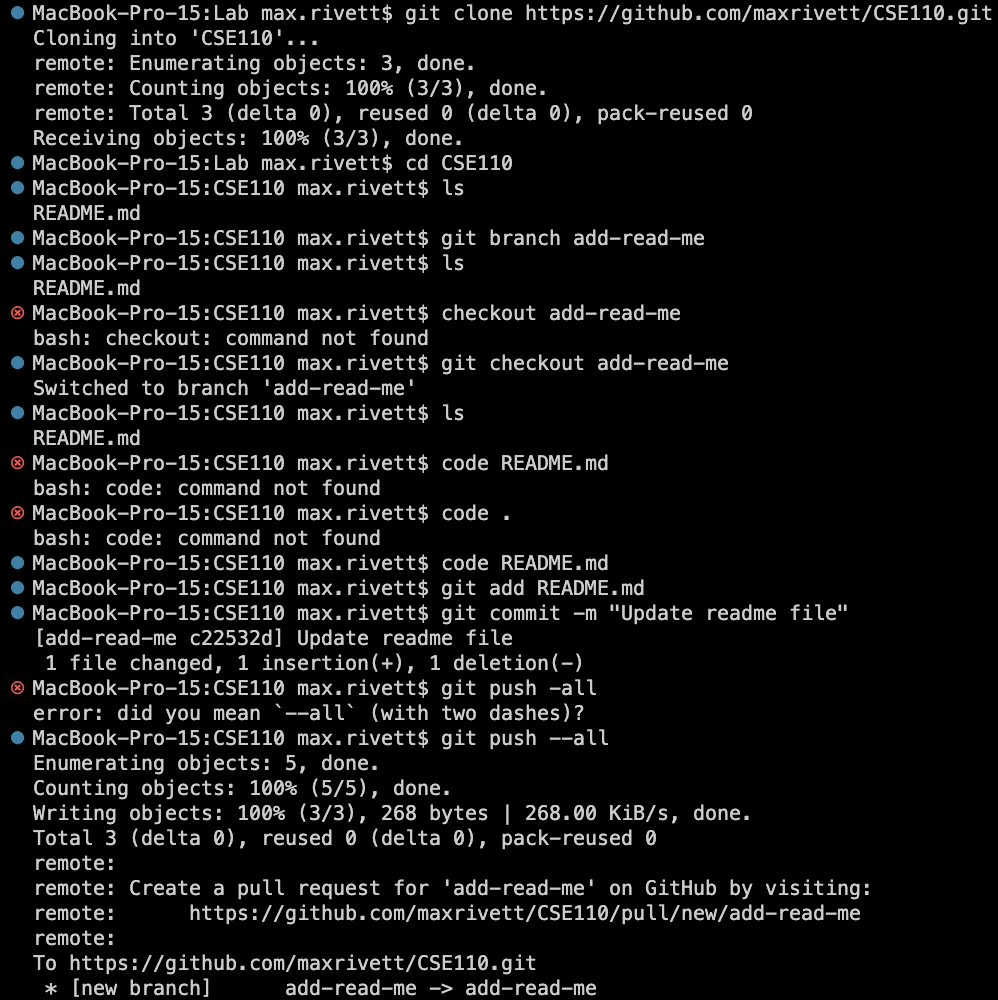
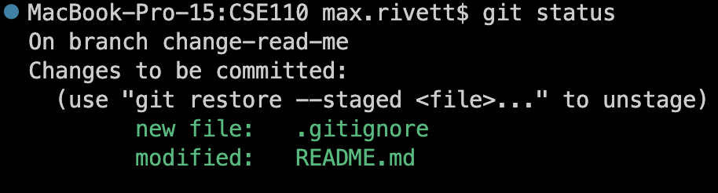

# Max Rivett

## My CSE 110 Page

### This is for the first lab.

**I am learning** *a lot* about how to use Markdown. 

> I am now using Markdown. 
> - Max Rivett

Inefficient Fibonacci Function:
```
function fib(n) 
    if n == 1 return 1
    if n == 2 return 2
    return fib(n-1) + fib(n-2)
```

Another [cool website](https://www.maxrivett.com/).

Return to the title: [Click this link!](#max-rivett)

[See my command line screenshot](screenshots/commandlinegit.png)

Speaking of screenshots, here are all three of them! (I took 2 for the staging):







- this
- is 
- an
- unordered
- list


1. this
2. is 
3. an 
4. ordered 
5. list


Thanks for viewing!